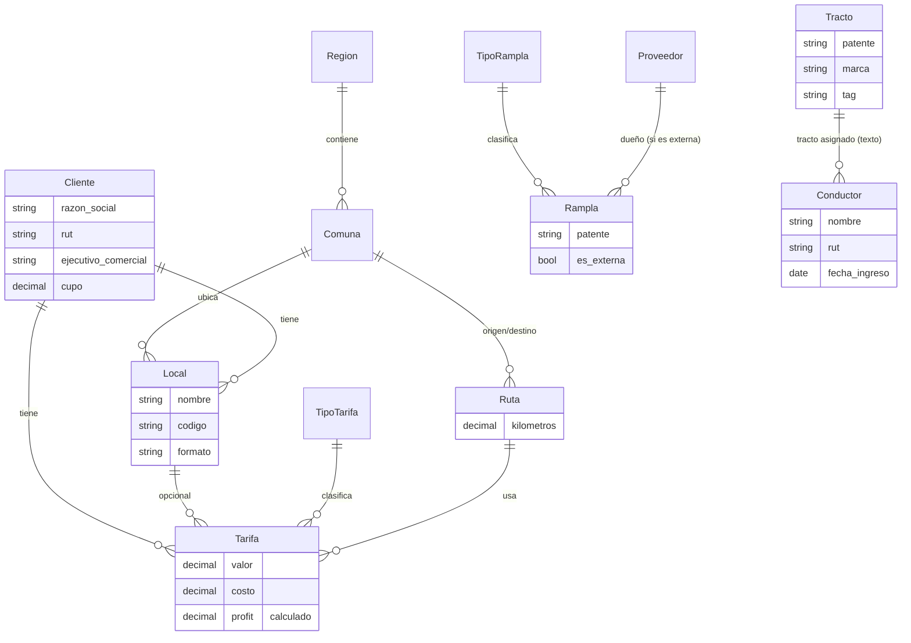

# Resumen — Módulo de Maestros de Transser One

**Fecha:** agosto 2026
**Alcance:** normalización de la base de datos, mantenedores de catálogos y validación contra el Excel operativo real de la empresa.

---

## 1. Por qué se hizo esto

El prototipo original de Transser One (apps `operaciones`, `catalogos`, `gastos`) guarda casi todo como **texto libre**: `Servicio.cliente`, `Servicio.conductor_principal`, `Servicio.tracto` y `Servicio.rampla` son campos `CharField`, sin relación real a una tabla. Funciona para una demo, pero no sirve para operar: no hay forma de estandarizar nombres de clientes, evitar errores de tipeo, reutilizar un mismo cliente en distintos servicios, o construir reportes confiables.

El plan de trabajo fue:

1. Levantar el modelo de datos correcto a partir de (a) el diagrama de flujo operacional de Transser One ERP y (b) una sesión de trabajo con capturas de un cuaderno de notas.
2. Construir esas tablas como catálogos **nuevos e independientes**, sin tocar todavía las tablas viejas (`Servicio`, `Conductor`, `Tracto`, `TarifaMaestra`) — para no romper nada que ya funcionaba antes de validar el diseño.
3. Validar (y corregir) ese diseño contra el Excel real que la empresa usa hoy para llevar la operación (`Walmart - transser actualizado.xlsx`).
4. Construir mantenedores (pantallas CRUD) para cargar y mantener esos catálogos.

---

## 2. Modelo de datos

### 2.1 Diagrama de entidades

> `Tracto`↔`Conductor` se muestra con línea punteada conceptual: hoy siguen unidos por texto libre (`tracto_patente`), no por FK — ver sección 4.

### 2.2 Las 16 tablas, campo por campo

| Tabla | App | Campos clave | Para qué sirve | Origen del diseño |
|---|---|---|---|---|
| **Región** | `maestros` | `nombre` | Las 16 regiones de Chile | Confirmado en hoja *Regiones* del Excel (columna región, formato romano `I, De Tarapacá`…) |
| **Comuna** | `maestros` | `nombre`, `región` (FK) | Comunas dentro de cada región | Notas de reunión + hoja *Regiones* (118 destinos) |
| **Cliente** | `maestros` | `razón social`, `rut`, `contacto`, `ejecutivo_comercial`, `cupo` | La marca dueña de la carga (Walmart, Cencosud, Sodimac...) — quien le paga a Transser | Notas de reunión, **confirmado y redefinido** con el Excel: al principio se asumió que "Cliente" podía ser el transportista (Fernandez, Agudi); se decidió con el usuario que Cliente = la marca |
| **Local** | `maestros` | `nombre`, `código`, `formato`, `dirección`, `comuna` (FK), `cliente` (FK) | Tiendas/sucursales de un cliente (ej. las 439 tiendas Walmart de la hoja *Locales*) | Hoja *Locales* del Excel — agregamos `formato` (Líder/Express/SBA/Mayorista/CD/Bodega Regional) porque aparecía real en los datos |
| **Tarifa** | `maestros` | `cliente` (FK), `ruta` (FK), `tipo_tarifa` (FK), `valor`, `costo`, `profit` (calculado) | Tarifa acordada por cliente y ruta, con costo y margen | Notas de reunión (valor, tipo, comuna) + **corregido** con la hoja *Regiones*, que trae Tarifa/Costo/Profit por separado — se agregó el campo `costo` que no estaba en el diseño original |
| **TipoTarifa** | `maestros` | `nombre` | Catálogo de tipo de carga por temperatura | Notas decían "Seca/Refrigerada"; el Excel real usa **Seco / Frío / Congelado** (+ "Multitemperatura" suelto) — se dejó como catálogo libre para no perder flexibilidad |
| **Rampla** | `maestros` | `patente`, `tipo_rampla` (FK), `es_externa`, `proveedor` (FK) | Remolques/semirremolques | Notas de reunión (tipo de rampla: plana, furgón seco, furgón refrigerado, sider) |
| **TipoRampla** | `maestros` | `nombre` | Catálogo de carrocería de la rampla | Notas de reunión |
| **Ruta** | `maestros` | `comuna_origen` (FK), `comuna_destino` (FK), `kilómetros` | Combinación origen→destino, reutilizable entre tarifas | Diagrama del cuaderno (ruta conectada a servicio/tarifa) |
| **Proveedor** | `maestros` | `nombre`, `rut`, `contacto` | Transportistas subcontratados (Fernandez, Agudi, Barz, DYL...) | Lista de tablas del cuaderno + **redefinido** con el Excel: son quienes transportan para Transser, no clientes |
| **CentroCosto** | `maestros` | `código`, `nombre` | Centros de costo para gastos/facturación | Lista de tablas del cuaderno |
| **Prioridad** | `maestros` | `nombre`, `orden` | Urgencia de un servicio | Lista de tablas del cuaderno |
| **TipoServicio** | `maestros` | `nombre`, `descripción` | Categoría de servicio de transporte | Lista de tablas del cuaderno |
| **FormaDePago** | `maestros` | `nombre`, `observación` | Métodos de pago con clientes | Cuaderno (bloque "forma de pago": nombre, observación) |
| **Tracto** *(legacy, enriquecido)* | `catalogos` | `patente`, `marca`, `modelo`, `tipo_camión`, `TAG`, `tarjeta_combustible`, `proveedor_gps`, `estado` | Camiones tracto de la flota | Ya existía con campos básicos; se agregaron marca/tipo/TAG/combustible/GPS/estado al ver la hoja *Transser* (roster de 9 tractos) |
| **Conductor** *(legacy, enriquecido)* | `catalogos` | `nombre`, `rut`, `teléfono`, `dirección`, `fecha_ingreso`, `tipo_contrato` | Choferes | Ya existía; se agregaron dirección/fecha de ingreso/tipo de contrato al ver la hoja *Transser* |

---

## 3. Cómo se usó el Excel (`Walmart - transser actualizado.xlsx`)

El archivo tiene 14 hojas. Se agruparon en tres tipos:

- **Catálogos reales**: `Locales` (439 tiendas Walmart), `Regiones` (tarifario por región/destino × Seco/Frío/Congelado, con costo y profit), `Transser` (flota: 9 tractos con marca/patente/conductor/TAG/GPS/combustible), `Tarifas-Fernandez` (tarifario del proveedor Fernandez por destino × marca).
- **Registro operativo mensual** (`Febrero` a `Julio`): un viaje por fila — cliente, sub-cliente, conductor, tracto, rampla, tipo de carga, destino, venta, factura, fechas de pago, abonos, OC.
- **Seguimiento de cobranza puntual**: `barz pendientes`, `Hoja1`.

**Lo que confirmó** el diseño que ya teníamos: existen de verdad Cliente, Local, Tarifa, Rampla, Tracto, Conductor, Región/Comuna como conceptos separados, y los datos están escritos a mano con inconsistencias (`Dyl`/`DYL`/`Dyl `, `refrigerado`/`Refrigerado`) — exactamente el problema que los mantenedores con catálogo (en vez de texto libre) resuelven.

**Lo que corrigió** el diseño original (de las notas de reunión):

1. **Tipo de tarifa**: no son 2 valores (Seca/Refrigerada) sino al menos 3 reales en uso (Seco/Frío/Congelado), más variantes sueltas.
2. **Cliente vs. Proveedor**: se confirmó con el usuario que el "Cliente" del Excel (Fernandez, Agudi, Barz...) es en realidad el *transportista subcontratado* → estos van a `Proveedor`, no a `Cliente`. El verdadero `Cliente` es la marca dueña de la carga (Walmart, Cencosud, Sodimac).
3. **Costo y Profit**: la hoja *Regiones* trae tarifa de venta, costo y profit en columnas separadas por cada destino — se agregó `Tarifa.costo` (con `profit` y `margen_pct` calculados) porque no estaba contemplado originalmente.
4. **Formato de local**: la hoja *Locales* trae un campo `Formato` (Líder/Express/SBA/Mayorista/CD/Bodega Regional) que no aparecía en las notas — se agregó a `Local`.
5. **Flota más rica**: la hoja *Transser* mostró que registran marca, tipo de camión, TAG, tarjeta de combustible y proveedor GPS por tracto, y dirección/fecha de ingreso/tipo de contrato por conductor — se agregaron esos campos a los modelos legacy `Tracto`/`Conductor` (de forma aditiva, sin tocar lo que ya usaban las vistas existentes).

**Lo que quedó identificado pero sin construir todavía** (ver sección 5).

---

## 4. Decisiones de diseño y su motivo

| Decisión | Motivo |
|---|---|
| Las tablas nuevas viven en una app separada `maestros/`, no se mezclaron con `catalogos/` | `catalogos` ya tenía `Conductor`, `Tracto`, `TarifaMaestra` en uso por las vistas de `operaciones`. Mezclar hubiera arriesgado romper flujos que ya funcionaban antes de validar el modelo nuevo con datos reales. |
| `Servicio.cliente/conductor/tracto/rampla` **no** se convirtieron a FK todavía | Decisión explícita del usuario: agregar los catálogos primero, conectar las relaciones después de validar campos con el Excel. Cambiarlo ahora habría exigido reescribir `crear_servicio`, `cambiar_rampla`, `modificar_tarifa` sin certeza del modelo final. |
| `Tarifa` (nueva, en `maestros`) convive con `TarifaMaestra` (vieja, en `catalogos`) | Mismo motivo: `TarifaMaestra` la sigue usando el formulario de creación de servicio hoy. No se retira hasta reemplazarla formalmente. |
| `Tracto`/`Conductor` se **enriquecieron** en lugar de crear tablas nuevas | A diferencia de Cliente/Local/Tarifa (que no existían), estas dos ya eran tablas reales (no texto libre). Agregar campos nuevos es aditivo y de riesgo cero: ninguna vista existente los usa, así que no puede romper nada. |
| `Tarifa.costo` es opcional (`blank=True, null=True`) | No todos los registros van a tener costo cargado desde el día uno; se calculó `profit`/`margen_pct` como propiedades derivadas (no se guardan en la base) para que nunca queden desincronizadas del valor/costo reales. |
| `TipoTarifa`, `TipoRampla`, `TipoServicio`, `FormaDePago`, `Prioridad`, `CentroCosto` son catálogos libres (`nombre` único) en vez de listas fijas (`choices`) | Los valores reales en el Excel son inconsistentes y van a seguir apareciendo variantes nuevas (ej. "Multitemperatura"). Un catálogo editable desde un mantenedor es más flexible que una lista hardcodeada en el código. |
| Sistema de mantenedores **genérico** (un registro + vistas reutilizables) en vez de una vista/plantilla por tabla | 16 tablas con CRUD idéntico (listar, buscar, crear, editar, eliminar) no ameritan 16 vistas y 16 templates casi iguales. Un registro central (`mantenedores.py`) + 4 vistas genéricas cubre las 16 tablas hoy y cualquier tabla nueva mañana sin escribir código repetido. Ver el manual técnico para el detalle. |

---

## 5. Pendiente / próximos pasos

1. **Conectar las FK**: una vez que se cargue el Excel real a los mantenedores, migrar `Servicio.cliente/conductor/tracto/rampla` de texto libre a relaciones reales.
2. **Facturación y Cobranza**: las hojas mensuales del Excel llevan factura, fecha de emisión, fecha de pago, abonos, OC y diferencias — un dominio completo que hoy no existe en el sistema (coincide con el bloque "Facturación y Cobranza" del diagrama de flujo operacional). Requiere su propio modelo de estados (Pendiente de Facturación → Facturado → Pendiente de Cobro → Cobrado).
3. **Viajes con múltiples paradas**: se detectó la columna "N° Locales" con hasta 8 paradas por viaje/HDR. El modelo actual de `Servicio` asume un solo destino — hay que decidir si se modela un detalle de paradas.
4. **Carga masiva** de los datos reales del Excel a los mantenedores nuevos (Clientes, Locales, Tarifas, Flota) — pendiente de que el usuario entregue/valide los datos limpios.
